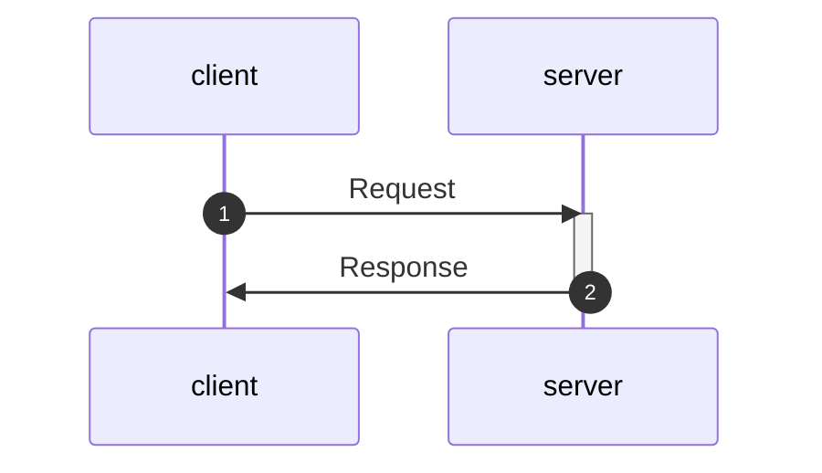

# gRPC Series with Node.js - Unary RPC

## What is gRPC?

According to the [grpc.io](https://grpc.io/)
**_gRPC is a modern open source high performance Remote Procedure Call (RPC) framework that can run in any environment. It can efficiently connect services in and across data centers with pluggable support for load balancing, tracing, health checking and authentication. It is also applicable in last mile of distributed computing to connect devices, mobile applications and browsers to backend services._**

This gRPC uses the HTTP/2 as underlying transport mechanism and it uses protocol buffers as a message format as explained in detail in this [gRPC crash course](https://www.youtube.com/watch?v=Yw4rkaTc0f8&t=2794s)

There are diffferent gRPC modes which are

- Unary RPC
- Server Streaming RPC
- Client streaming RPC
- Bidirectional streaming RPC

In this article we will focus on Unary RPC, which is basically client send a request to the server and server process that request and send back the response after processing the request.

## Protocol Buffers

Before writing the protocol buffers file we need to know what is protocol buffer
Protocol buffers or protobuf for short is method of serialization structured data useful for transmitting data over the wire or storing the disk. There is very good protocol buffers crash course [video](https://www.youtube.com/watch?v=46O73On0gyI&t=1716s) which gives detail information about the protocol buffers, and it is highly recommended to watch this [video](https://www.youtube.com/watch?v=46O73On0gyI&t=1716s)

```protobuf
// protocol/square.proto
syntax = "proto3";

package square.v1;

message squareRequest {
    double number = 1;
}

message squareResponse {
    double number=1;
}


// Services for the system
service SquareService {
    rpc square(squareRequest) returns (squareResponse) {}
}
```

The protocol buffer structure is first we define the syntax which is proto3 in this case, and then we define the package name and we use square.v1 as the name. The we define Request and Response structure for our square service. Once we have protocol buffer file ready we can start using it.

We use Nodejs for writing server and client, before writing we need to set our project using the following steps:

```console
npm init -y
```

Once project is setup we install the required dependencies by running the following command on terminal:

```console
npm install grpc @grpc/proto-loader
```

Once installation is finished we are going to write server.js file, and is giving below

## Server (server.js)

```javascript
// importing dependencies
const grpc = require("grpc");
const path = require("path");
const protoLoader = require("@grpc/proto-loader");

// package definition
const packageDefinition = protoLoader.loadSync(
  path.resolve(__dirname, "protocol/square.proto"),
  {
    keepCase: true,
    longs: String,
    enums: String,
    default: true,
    oneofs: true,
  }
);

const protoDescriptor = grpc.loadPackageDefinition(packageDefinition);

// Get the package name
const squarePackage = protoDescriptor.square.v1;

// calculate the square of the number
const square = (call, callback) => {
  const number = call.request.number;
  const square_number = Math.pow(number, 2);
  response = { number: square_number };
  error = null;
  callback(error, response);
};

// Creating the Server
const server = new grpc.Server();
// Adding services to the server
server.addService(squarePackage.SquareService.service, {
  square: square,
});

// Binding the server
const HOST = "localhost";
const PORT = 90052;
server.bind(`${HOST}:${PORT}`, grpc.ServerCredentials.createInsecure());

// starting the grpc server
server.start();
console.log(`Server started on ${HOST}:${PORT}`);
```

In server.js we imported necessary dependencies, then we loaded the protobuf file which is square.proto, and after that we get the service package. As we are going to get a number and it will return the square of the number we have the function square which calculate the square. And after that we created a server and then it is started on localhost:90052.

Once the server is ready, we can run the server using the following command:

```console
node server.js
```

and we will have following output:

```console
Server started on localhost:90052
```

Once the server is ready, we can write the client side code and is given below

## Client (client.js)

```javascript
// importing dependencies
const grpc = require("grpc");
const path = require("path");
const protoLoader = require("@grpc/proto-loader");

// package definition
const packageDefinition = protoLoader.loadSync(
  path.resolve(__dirname, "protocol/square.proto"),
  {
    keepCase: true,
    longs: String,
    enums: String,
    default: true,
    oneofs: true,
  }
);

const protoDescriptor = grpc.loadPackageDefinition(packageDefinition);

// Get the package name
const squarePackage = protoDescriptor.square.v1;

// connect the client to the server
const HOST = "localhost";
const PORT = 90052;
const client = new squarePackage.SquareService(
  `${HOST}:${PORT}`,
  grpc.credentials.createInsecure()
);

// make the request for server to calculate the square of the number
const request = { number: 10.2 };

// make request, and get the response
client.square(request, (err, response) => {
  console.log(response);
});
```

We have teh same structure as we have in server.js, except now we are sending request to the server.

once our client is ready, we can send the request to the server by running the following command on another terminal:

```console
node client.js
```

and we will have the following output:

```console
{number: 104.0399999999}
```

## Flow chart



## TodoList

- [✓] uniary methods
- [] grpc explanation
- [] streaming methods
- [] proto explanation
- [] step by step code explanation
